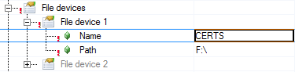
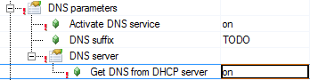
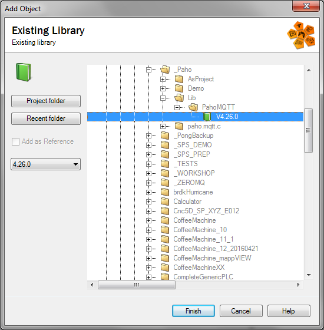
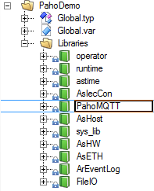
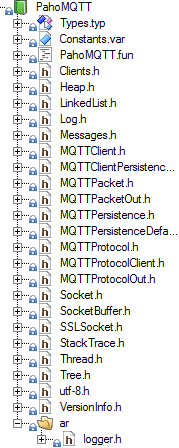
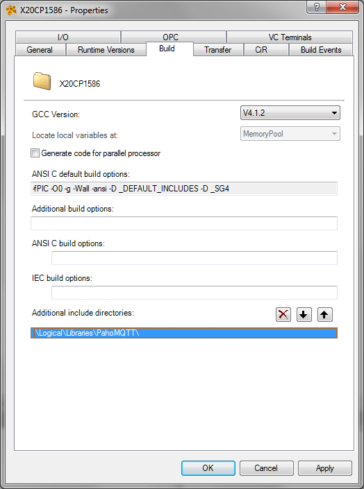
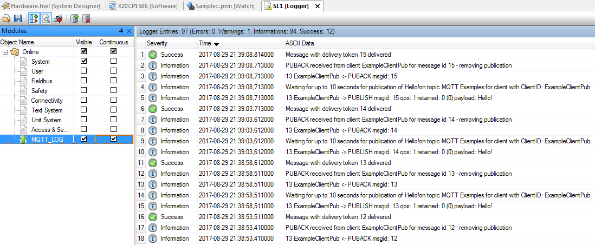

# PahoMQTT_Library
Eclipse Paho MQTT Client Library for B&amp;R SG4 targets

## Prerequisites

To get started with Paho MQTT, please visit http://www.eclipse.org/paho/

For the B&amp;R Platform, you basically need

- A MQTT broker on another system, like mosquitto
- certficates (if desired)
- The PahoMQTT Library

## Preparations

If you are using certificates for a secure connection, you make them avialable for your Controller under the filedevice "CERTS". Easiest way to do this, is to copy the folder with the certificates to the USER partition, and create a FileDevice "CERTS" under "F:\". Further, if you are accessing a host name rather than an IP-address, you need to enable the DNS service in the controller.

#### Create a CERTS file device

#### Enable DNS Service

## Getting Started

Now the system is configured to the extent that you can insert the PahoMQTT Library and start creating your application. The PahoMQTT libary should be inserted as an Exisiting Libary under the Logical view, and then you insert the sample task(s) as Existing programs.

#### Insert the PahoMQTT Library

The Version of the Library reflects the Runtime version it is compiled for, in this case, AR4.26.

The Library has dependencies to other B&R Libraries, that will be inserted automatically.

#### Automatically Inserted Libraries

All headerfiles you need are part of the PahoMQTT Library, so you just need to setup the compiler to include these files in the build. This can be done on a global level (as in the picture) or on a task-local level.

#### Headerfiles of PahoMQTT

#### Setup the Include directory for the Headers

Now you are ready to create your MQTT application task. 

## Using the Library

In order to get started, insert the sample task available here as an existing program, basically starting up your client thread

	void sample(unsigned long param); //the Paho sample thread
	
	void _INIT ProgramInit(void)
	{		
		PahoMQTT_Init_0.EnableLogger = 1;
		PahoMQTT_Init_0.MainThread = (UDINT)sample;
		PahoMQTT_Init_0.ThreadParam = (UDINT)Message;
		PahoMQTT_Init_0.SuspendThread = 1;
		PahoMQTT_Init(&PahoMQTT_Init_0);
	}

The sample itself needs to run as an asynchronous thread, which the Library has already taken into consideration. You therefore pass the function pointer to the sample program to the MainThread Input. If you want, you can also pass other arguments, such as a structure pointer using the MainParam input.

In this case the Logger is enabled, and the sample task starts suspended, therfore you need PahoMQTT_Cyclic to start the thread using the Resume input. With the PahoMQTT_Cyclic.LoggerLevel you can also control which level of logmessages you want to have in the logger. The PahoMQTT_Exit is used to shutdown the AWS sample task and kill the thread when the program is redownloaded.

	void _CYCLIC ProgramCyclic(void)
	{
		PahoMQTT_Cyclic(&PahoMQTT_Cyclic_0);
	}
	
	void _EXIT ProgramExit(void)
	{
		PahoMQTT_Exit();
	}

When you have come this far, you should see the result in the Logger.

