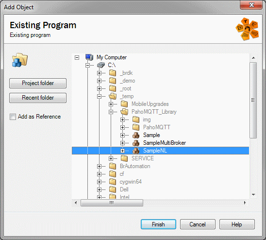
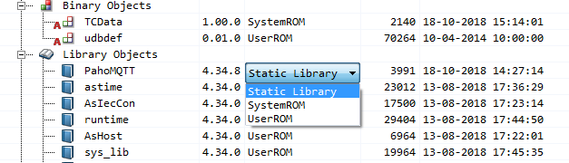
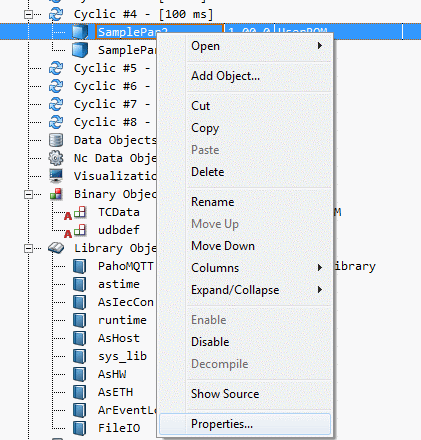
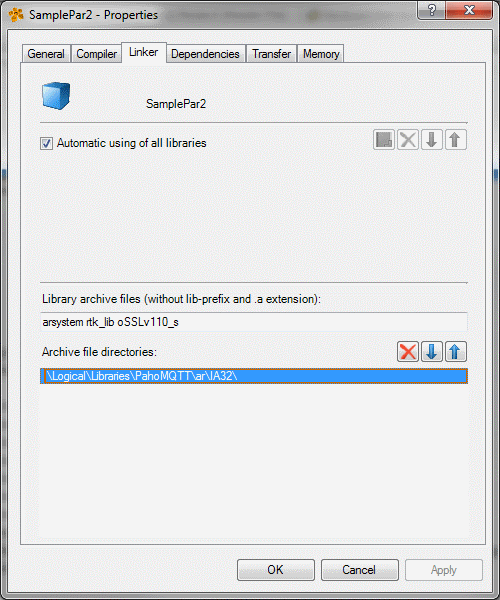
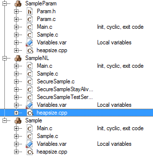

# PahoMQTT_Library
Eclipse Paho MQTT Client Library for B&amp;R SG4 targets

## Version Information
This is a compiled library for B&R SG4 Targets using
[https://github.com/eclipse/paho.mqtt.c](https://github.com/eclipse/paho.mqtt.c), Release version 1.2.0

Encryption is based on openSSLv1.1.0f [https://github.com/openssl/openssl/releases/tag/OpenSSL_1_1_0f](https://github.com/openssl/openssl/releases/tag/OpenSSL_1_1_0f)

Versions / AR Support:

This library is updated via a revision number, whereas the version number follows the Automation runtime version that it is compatible with. All revisions for certain version will have the format X.XX.0 in Automation Studio, as revision numbers cannot be part of the version number.

The revision number (defined in <ar/logger.h> can be seen as the first entry in the logger.

- V4.26.0-rev.11: Automation Runtime 4.26 
- V4.34.0-rev.11: Automation Runtime 4.34
- V4.45.0-rev.11: Automation Runtime 4.45
	- Added Reset functionality in order to connect to another thing during runtime
	- V4.45.0 is only avialable as static library for ARM targets, see "Using Multiple Clients (Static Linking)"
	- Initialization of threads was not made automatically in previous versions. With this static linking of multiple clients had the potential problem of colliding resources. This is fixed by automatic initialization.
- V4.26.0-rev.10: Automation Runtime 4.26 
- V4.34.0-rev.10: Automation Runtime 4.34
	- Library supports multiple clients by static linking, in "normal" dynamic library mode, only one client instance is possible - the function blocks will return an error if you try something that isnt possible.
	- Fixed openSSL error handling, which previously added entries in the logger that were not in fact errors. This has been corrected, and now only relevant errors are shown following the PahoSSL error.
	- Small memory leak fixed inside openSSL that ate some 50-100 bytes when trying to open a certificate that was not on the system.

It has been tested on following hardware / runtime:

 - CP1586 / D4.26
 - CP1586 / E4.34
 - CP1586 / I4.34
 - CP0484 / E4.34
 - CP1586 / B4.45
 - CP0484 / B4.45
## Prerequisites

To get started with Paho MQTT, please visit [http://www.eclipse.org/paho/](http://www.eclipse.org/paho/)

For getting certificates up running on your mosquitto broker (in Linux), see [https://mosquitto.org/man/mosquitto-tls-7.html](https://mosquitto.org/man/mosquitto-tls-7.html)

For the B&amp;R Platform, you basically need

- A MQTT broker on another system, like mosquitto
- certficates (if desired)
- The PahoMQTT Library

## Preparations

If you are using certificates for a secure connection, you make them avialable for your Controller under the filedevice "CERTS". Easiest way to do this, is to copy the folder with the certificates to the USER partition, and create a FileDevice "CERTS" under "F:\". Further, if you are accessing a host name rather than an IP-address, you need to enable the DNS service in the controller.

#### Create a CERTS file device

#### Enable DNS Service

## Getting Started

Now the system is configured to the extent that you can insert the PahoMQTT Library and start creating your application. The PahoMQTT libary should be inserted as an Exisiting Libary under the Logical view, and then you insert the sample task(s) as Existing programs.

#### Insert the PahoMQTT Library

The Version of the Library reflects the Runtime version it is compiled for, in this case, AR4.34.

The Library has dependencies to other B&R Libraries, that will be inserted automatically.

#### Automatically Inserted Libraries

All headerfiles you need are part of the PahoMQTT Library, so you just need to setup the compiler to include these files in the build. This can be done on a global level (as in the picture) or on a task-local level.

#### Headerfiles of PahoMQTT

#### Setup the Include directory for the Headers

Now you are ready to create your MQTT application task. 

## Using the Library

In order to get started, insert one of the Sample tasks available here.

- [Sample](Sample/) : Very simple example, publishing a hello world message
- [SampleNL](SampleNL/) : Some more samples, with reconnecting at interruption, and SSL communication 
- [SampleParam](SampleParam/): Example that allows multiple client instances

You select the folder as an existing program, basically starting up your client thread

	void sample(unsigned long param); //the Paho sample thread
	
	void _INIT ProgramInit(void)
	{		
		PahoMQTT_Init_0.EnableLogger = 1;
		PahoMQTT_Init_0.MainThread = (UDINT)sample;
		PahoMQTT_Init_0.ThreadParam = (UDINT)Message;
		PahoMQTT_Init_0.SuspendThread = 1;
		PahoMQTT_Init(&PahoMQTT_Init_0);
		
	}

The sample itself needs to run as an asynchronous thread, which the Library has already taken into consideration. You therefore pass the function pointer to the sample program to the <code>MainThread</code> Input. If you want, you can also pass other arguments, such as a structure pointer using the <code>MainParam</code> input.

If the sample task starts suspended using the <code>PahoMQTT_Init_0.SuspendThread</code>, you need to start the thread using the <code>PahoMQTT_Cyclic_0.Resume</code> input. The <code>PahoMQTT_Exit()</code> is used to shutdown the AWS sample task and kill the thread when the program is redownloaded. If you want to reset the connection from the asynchronous thread, you can use <code>PahoMQTT_Init_0.Reset</code> and <code>PahoMQTT_IsReset()</code>. For more info on this, see "Resetting the Connection".

	void _CYCLIC ProgramCyclic(void)
	{
		PahoMQTT_Cyclic(&PahoMQTT_Cyclic_0);
	}
	
	void _EXIT ProgramExit(void)
	{
		PahoMQTT_Exit();
	}

In this case the Logger is enabled using <code>PahoMQTT_Init_0.EnableLogger</code>, you can control which level of logmessages you want to have in the logger using <code>PahoMQTT_Cyclic_0.LoggerLevel</code>.

When you have come this far, you should see the result in the Logger.

## Using Multiple Clients (Static Linking) ##

In **V4.34.8 / V4.xx.0 Revision 10**, multiple clients are enabled by static linking of the Library. Static linking basically means that the complete PahoMQTT and openSSL is compiled into your task, instead of PahoMQTT exisiting as a standalone Library that you (dynamically) link to. With this, the PahoMQTT can run in several instances without interfering with the internal data resources it only has setup once in the library. The drawback are some extra settings and that the Task binaries will become bigger, as they include the complete libraries.

If you follow the steps from above, what you need to change is the following:

Change the PahoMQTT to be a Static Library in the Software Configuration

After this, you only need to add some extra linking to the Sample Task, as it now explicitly needs to know where to find all the functions that were made available through the dynamic library and exported functions. 

You setup the Linker options by selecting Properties on the Task in the Software Configuration, or press ALT+Enter.

In the linker tab, add the Line

	arsystem rtk_lib oSSLv110_s

And for the directory, if you put PahoMQTT under Libraries, point to 

	\Logical\Libraries\PahoMQTT\ar\IA32\

For ARM targets (Compact-S / X90) point to  

	\Logical\Libraries\PahoMQTT\ar\ARM\

It should look like this

Not that you need to do this for every task. But then again, you now have the possibility to run several clients on your system. 

**Important Note**

If you havent doen this already, you need to activate the c++ compiler and the dynamic heap managment for your task now that you are linking static, and it therefore is the task itself that defines the dynamic heap that is available for the PahoMQTT Library.

If you omit this, you will get some undefined references to lseek, feoef, stat and so on.

You activate the dynamic heap by adding a .cpp file, like `heapsize.cpp` to you task, and in the code you write

	unsigned long bur_heap_size = 1000000;

This preallocates 1MB dynamic heap for this client instance. 

### Resetting the Connection

With Revision 11, theres a new function to reset or change your connection to another thing. You do this with `PahoMQTT_IsReset()` in your MainThread and `PahoMQTT_Cyclic_0.Reset` in the _CYCLIC program.

It is important to mention, that `PahoMQTT_IsAlive()` will go low until `PahoMQTT_IsReset()` is called, to fall out of the inner loops. That means, if you do not call the `PahoMQTT_IsReset()` at the end of the loop, and you make an `PahoMQTT_Cyclic_0.Reset`, the client will simply disconnect and fall out of the mainthread. 

The sample program in this repository already has this additional `do{ ... }while(PahoMQTT_IsReset());`  in the code, but heres where to put it

**Sample.c:**

	void sample(unsigned long param)
	{
		char *message = (char *)param;

		do //here!
		{  //here!

			MQTTClient client;
			MQTTClient_connectOptions conn_opts = MQTTClient_connectOptions_initializer;	
			...
	
					PahoMQTT_Sleep(5000);
				}
		    
			}
			MQTTClient_disconnect(client, 10000);
			MQTTClient_destroy(&client);
			
		} while(PahoMQTT_IsReset()); //and here!

	}

The [SampleParam](SampleParam/) has this functionality builtin, which lets you reconnect and change broker.

